# Double Dragon

a Voron Zero mod to add Independent Dual Extrusion (IDEX).  "X0" for short.  **Now printing!**

**X0** adds a second printhead to a [V0](https://vorondesign.com/voron0.1) to enable multi-color prints, multi-material prints, and even overhangs atop dissolvable supports.  

*This repo includes everything you need to build your own X0, including CAD and STLs for printed parts, DXFs for panels, a list of parts, and a sample Klipper config.*  The .STEP file is now in the repo too.

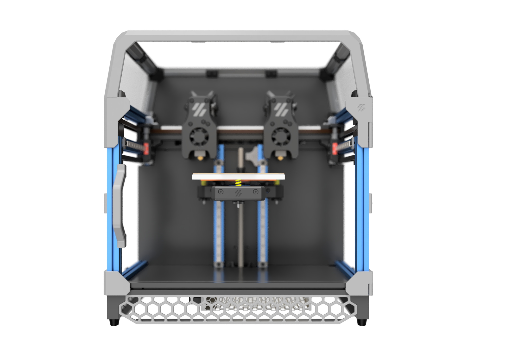

## Updates
* **2022-01-02** First multi-extruder prints!  See the alternating-copper-and-brass print below.
* **2022-01-01** See [this Reddit discussion](https://www.reddit.com/r/VORONDesign/comments/ru64ti/idex_v0_bad_idea_or_terrible_idea/) for reactions to the concept: bad idea, or terrible idea?
* **2021-12-31** Initial alpha-1 release!  This one was fun.  Came together quickly, too.

## Alpha-1 Release 2021-12-31


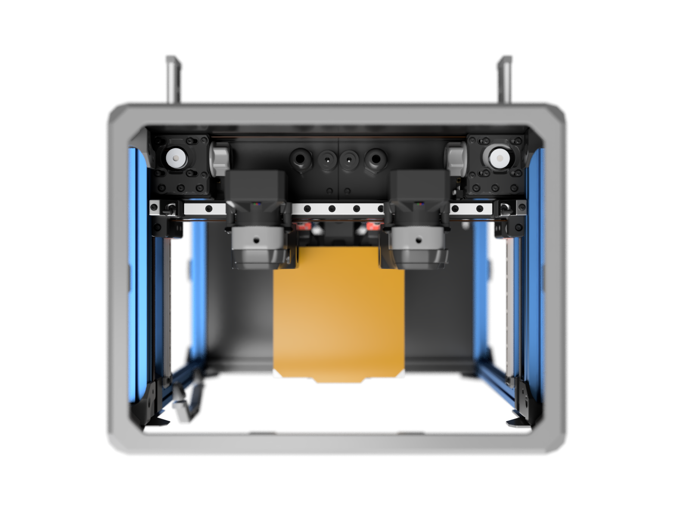

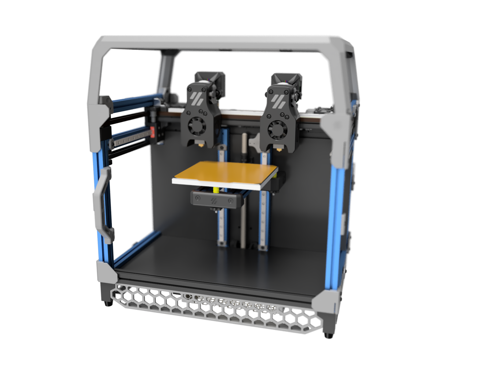

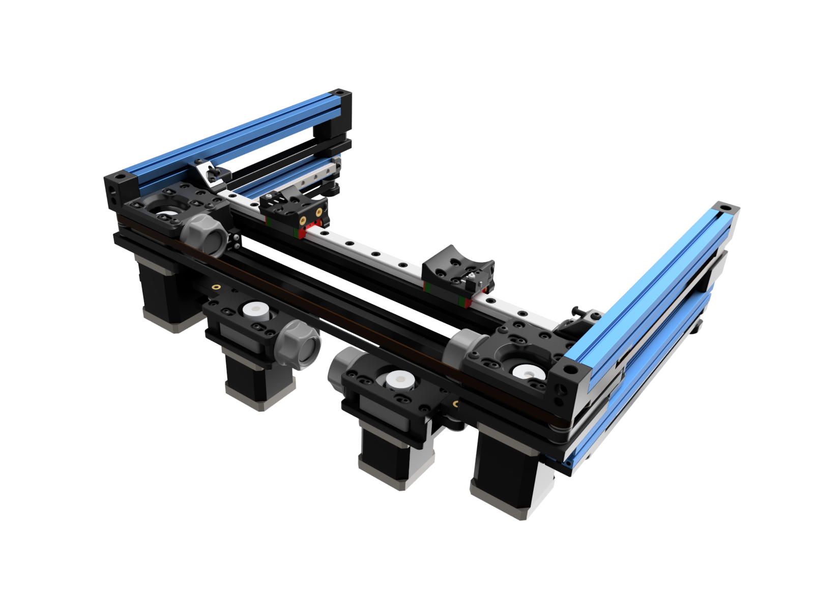

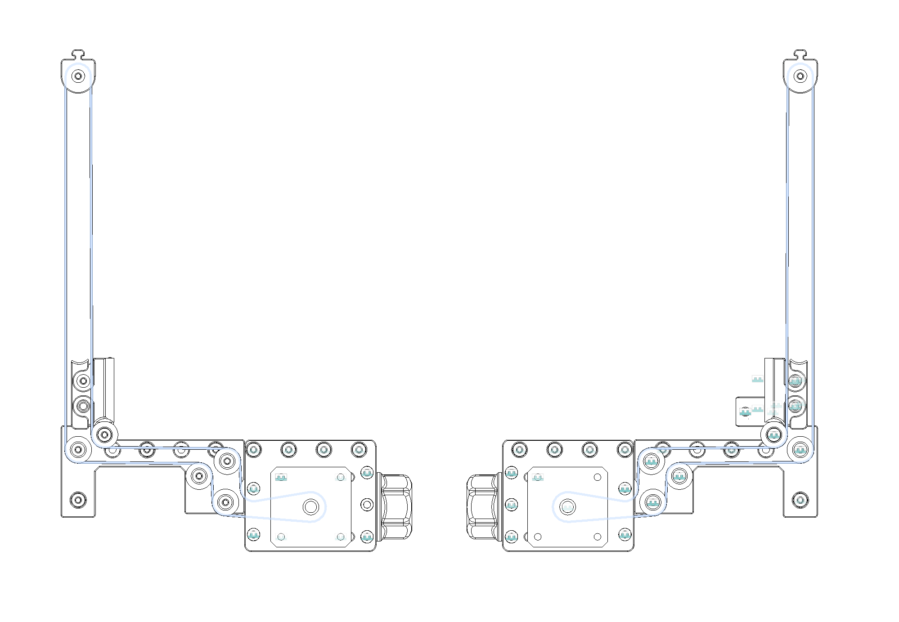

### Yes, it's real, and yes, it prints.  X0.000 in progress:


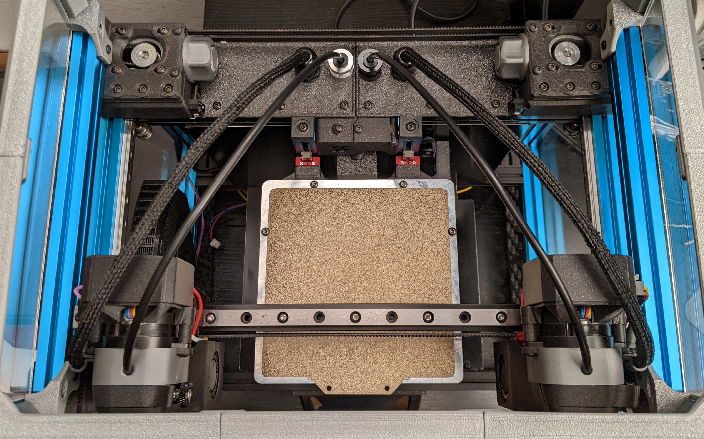

Sample print with two extruders in one part, with brass and copper PLA.

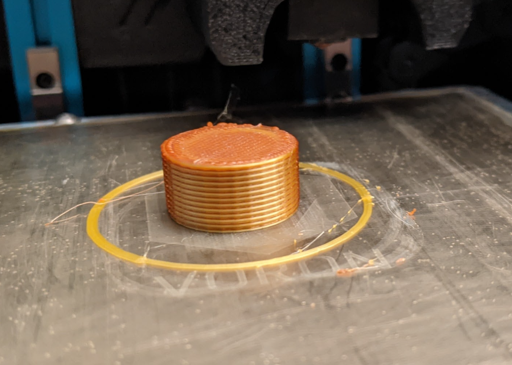

Videos coming soon.

### Fun parts

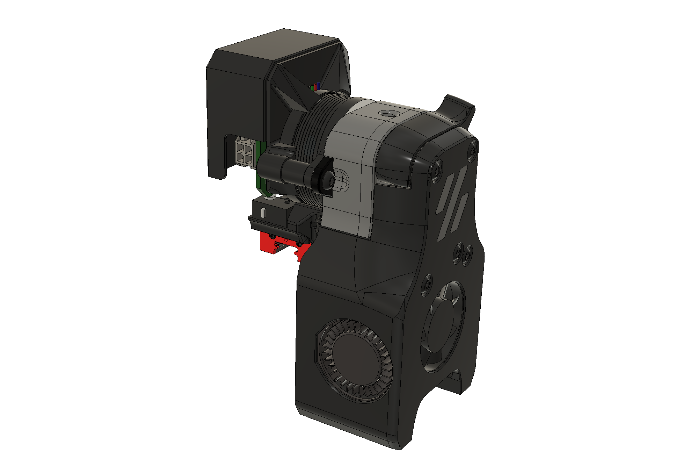

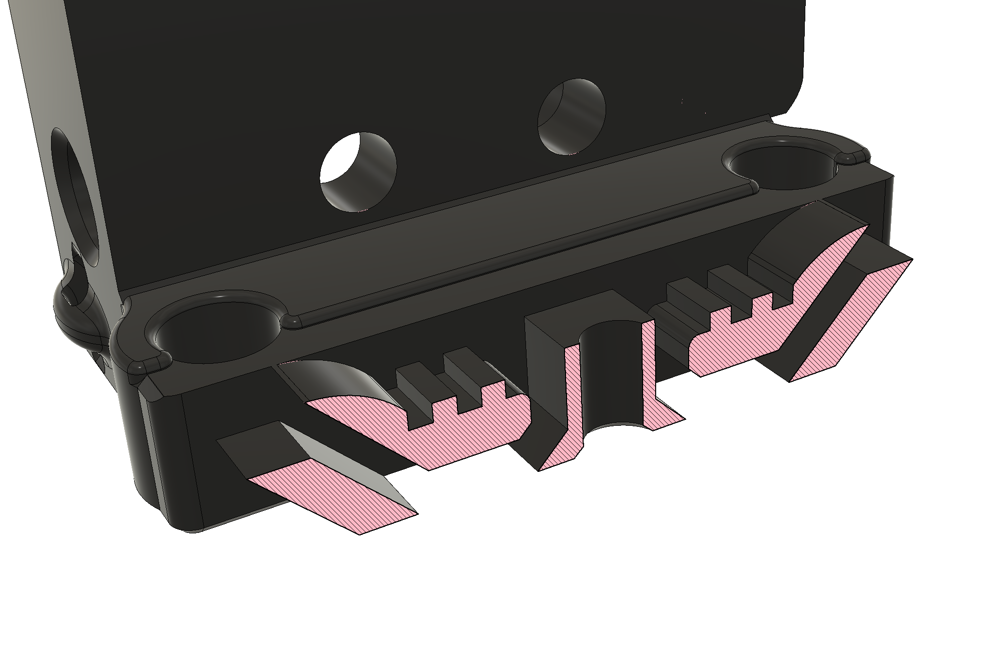

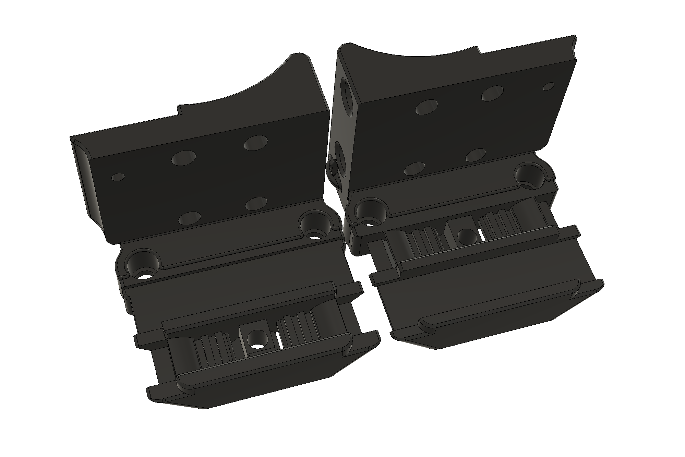

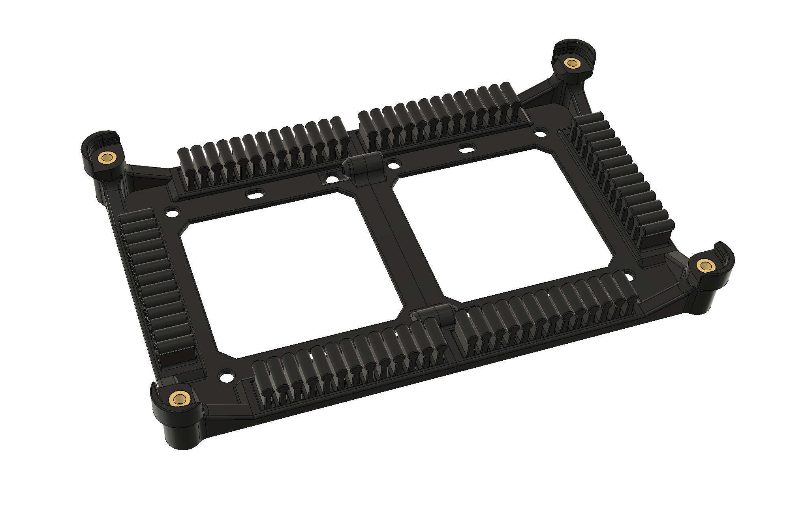

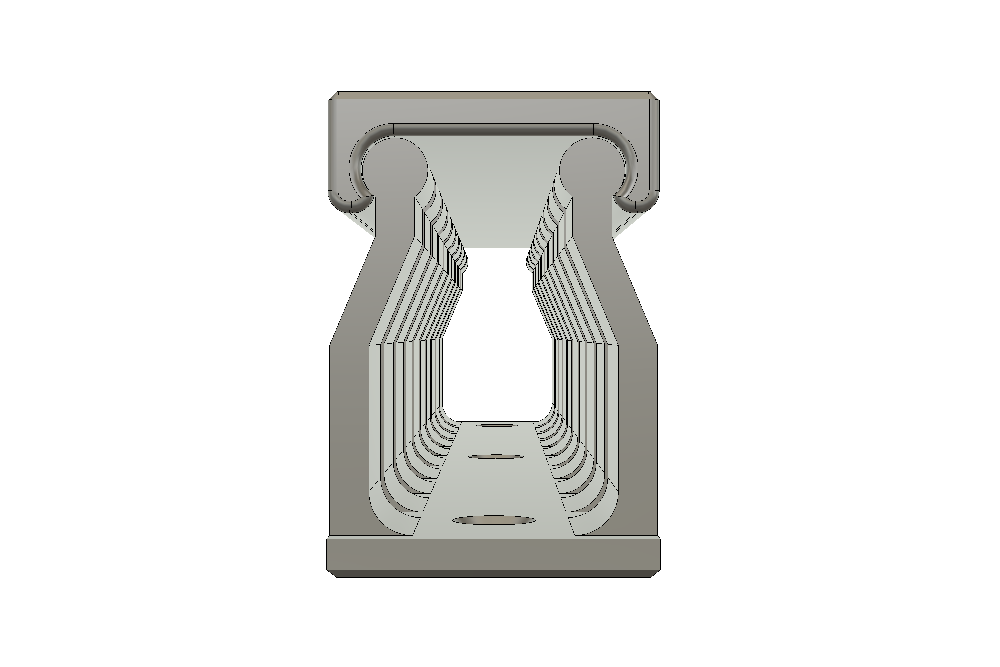

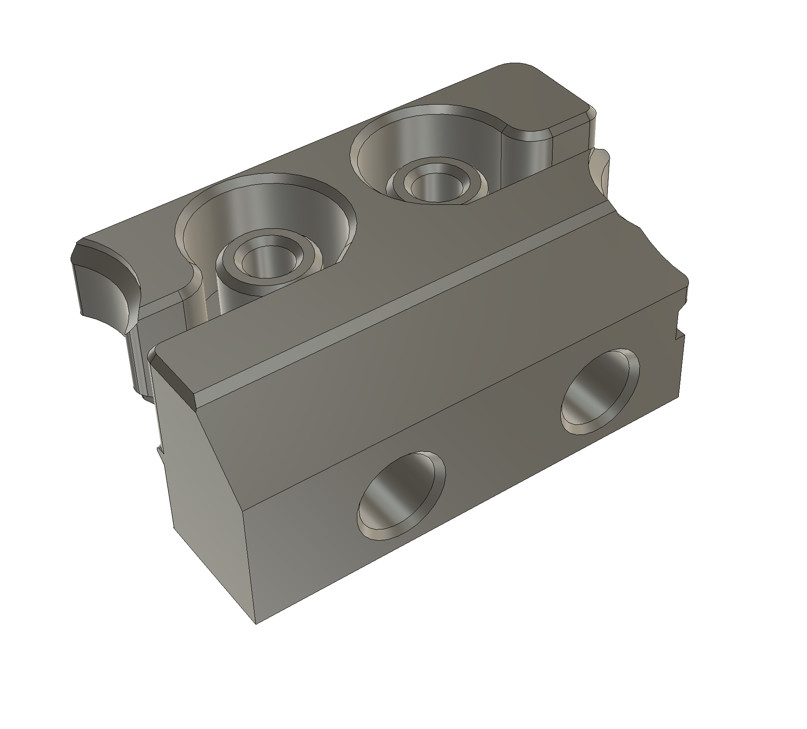

## I'm interested. What do I need to do?

Take a V0, then..

#### Double up the toolheads
You'll need a second toolhead.
* A default [V0.1 Mini Afterburner toolhead](https://github.com/VoronDesign/Voron-0/tree/Voron0.1/STLs/Toolheads/Mini_Afterburner) works fine, but anything V0-X-carriage-compatible will work too, like the [Mini AfterSherpa](https://github.com/KurioHonoo/Mini-AfterSherpa), which has some nice features.
* Toolhead boards are highly recommended, whether with-chip like the [Huvud](https://github.com/bondus/KlipperToolboard) or chip-less ([Pancake Board](https://github.com/christophmuellerorg/voron_0_pancake_board), [Timmit's V0 Umbilical](https://github.com/VoronDesign/Voron-Hardware/tree/master/V0-Umbilical), …).
* Anything that changes the X carriage will NOT work, such as the [Mini After-LGX-lite](https://www.bondtech.se/2021/12/27/voron-v0-1-toolhead-setup-for-lgx-lite/), at least until any changes are ported over.

#### Widen all the things!
* **100mm-wider extrusions** - 4x 300mm; [MakerBeamXL](https://www.amazon.com/MakerBeam-XL-Anodized-300x15x15mm-Pieces/dp/B06XJ5G5QY), Misumi, or whatever you prefer.  Or, keep the colorful extrusions from a kit and augment with 8x 50mm extensions, joined by M3 threaded rods, 3mm shafts, or long M3 screws.
* **100mm-longer X rail (250mm)** - a medium preload MGN9 rail with two MGN9C carriages is recommended, as it reduces the potential for toolhead wobble.  Ask the seller for medium preload at purchase time and ask them to put both carriages on the rail.  Make sure to order two carriages!  [CNA rail and carriages on AliExpress](https://www.aliexpress.com/item/32773296501.html?spm=a2g0s.12269583.0.0.4ea2494dwPIVR2)
* **100mm-plus wider bed (optional)** - see notes below.
* **100mm-wider panels (optional)** - see DXFs folder and image below.  You can ignore these if the printer is unenclosed, or you can make printed 50-mm-wide shim parts, possibly with a nice accent color.  The tophat panels are a bit harder to extend, but you could shim these too, potentially.
* **100mm-wider skirts (optional)** - this repo includes a 100mm hex skirt to match the [default V0.1 skirts](https://github.com/VoronDesign/Voron-0/blob/Voron0.1/STLs/Skirt_x3.STL). X0.000 above has custom 70mm skirts to fit a [4" touchscreen mod](https://github.com/Fleafa/VoronUsers/tree/V0.1-Trident-skirt/printer_mods/roboticator24/4inch_touchscreen_mount_for_v2.4) for [KlipperScreen](https://github.com/jordanruthe/KlipperScreen).  But again, use what you like, such as [MCMBen's Trident-style skirts](https://github.com/Fleafa/VoronUsers/tree/V0.1-Trident-skirt/printer_mods/MCMBen/Voron0_Trident_Skirt), which nicely integrate the mini V0 display you may already have.

The panel order looks like this, from SendCutSend:

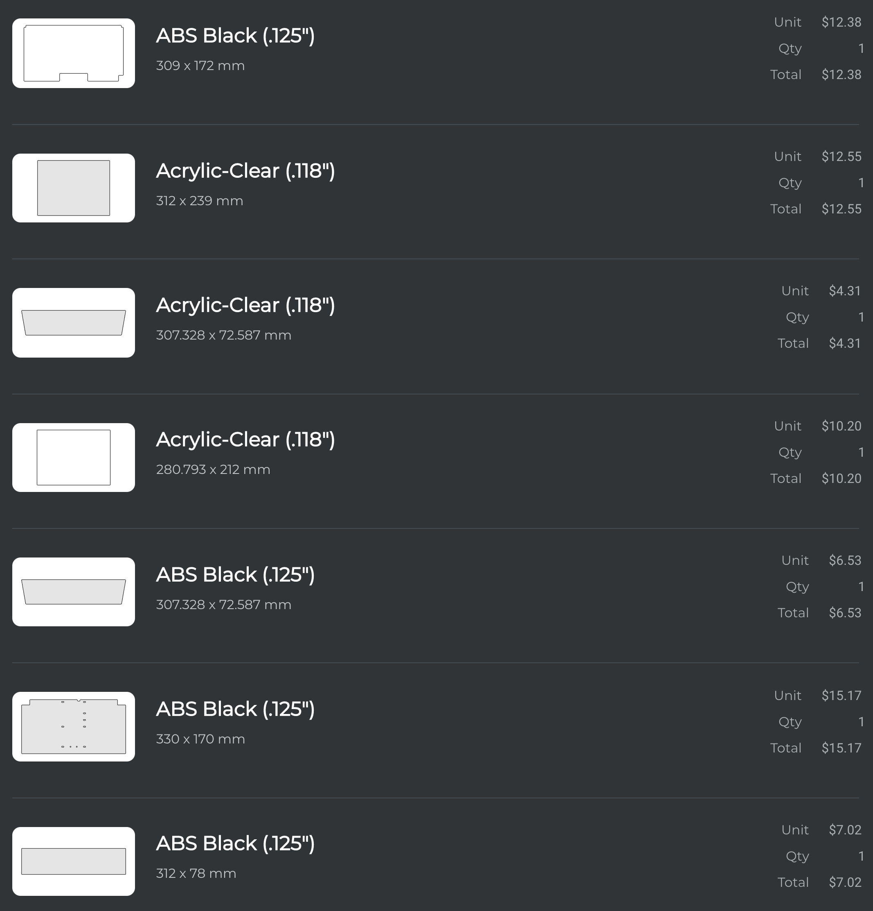

#### Add more drives!
This mod uses two Y motors for simplicity in a `hybrid-corexy` config.  You'll need:
* **Belts**: +N 6mm-width GT2 belt; can reuse your now-too-short belts on the Y drives.
* **Pulleys**: +2 20-tooth GT2
* **Endstops**: +2 Omron D2F switches
* **Bearings**: +28 F623 bearings (sorry for the number... had to fit the existing V0 footprint)
* **Motors**: +2 NEMA14 for the Y drives.  If using full-length 48mm+ motors, an Octopus will not fit the provided mount, but a Spider will.  V0.0-stock motors are shorter and will fit.
* **M3 Screws**: Yes, all BHCS; includes at least M3x6, M3x8, M3x10, M3x12, M3x16, M3x20, M3x25.
* **M3 Nuts**: Yes
* **M3 Heatsets**: Yes
* **M3 Washers**: Yes

Note, parts above are *just* for drives, not for the toolhead.  Those will add to the bill of materials.

Also: **additional stepper driver ports**.  Octopus, Spider, Fly, GTR, S6, 2x SKR Mini/Pico, … Klipper doesn’t care.  Use whatever you’ve got that gives you added ports.  You need an extra 2 stepper ports for Y motion and one extra stepper port for the second extruder, unless you go with a toolhead board.

#### More power!!!  

The extra power draw of three more steppers, plus an extra toolhead heater, **absolutely** requires a more capable power supply than a stock V0, whether 100W for an AC bed or 150W for a DC bed.  DO NOT run without known margin.  If you're not sure, buy or borrow an inline power meter to confirm.

A second power supply or larger one both will work fine.  The good news is that you have 100mm additional width to fit it below the main deck panel.

Consider a UHP200, dual LRS-100-24 units (what I use), an LRS-350-24 if you don't mind occasional fan noise, an LRS-150-24 with an AC bed, or really, anything else.

There’s no BOM yet, because there’s only two new parts for the BOM - the longer rail and the longer extrusions.

#### Printed parts (required)

Most of the bigger parts are *fully reused* from a V0.  That’s kinda the point here… take a V0 and make it an IDEX with the fewest modifications possible.  That includes the toolhead, AB blocks, front idlers, top gantry parts, and enclosure parts.

What remains?  You’ll need a few new parts, plus a few copies of existing V0 parts.  But surprisingly, not that much.  Everything is printable on the 120x120 bed of a V0.

| Category | Part | Qty | Notes |
| - | - | - | - |
| X Gantry | ```XY_Joint_Lower_Extended``` | 1 + 1 | Enables attachment to Y belt blocks |
| | ```X_Endstop``` | 1 + 1 | Enables tightening + tensioning without screw interferences |
| | ```X_Carriage``` | 1 + 1 | Needed to support belt passthrough for hybrid-corexy layout; leaves extra belt around, so it improves the experience of tightening/retightening |
| Y Drives | ```Y_Belt_Attachment``` | 1 + 1 | Perfect fit with the Y drive pulleys to enable 120mm Y travel
| | ```Y_Front_Idler_Mount``` | 4 | Spaces and retains Y front idler bearings |
| | ```Y_Bearing_Plate``` | 1 + 1 | Holds bearings to route the belts |
| | ```Y_Drive_Frame_Upper``` | 1 + 1 | Shortened and modified V0 part |
| | ```Y_Drive_Frame_Lower``` | 1 + 1 | Shortened and modified V0 part |
| | ```Y_Drive_Tensioner``` | 2 | Shortened and modified V0 part |
| | ```Tensioner_Knob``` | 2 | [Extra of a stock V0 part](https://github.com/VoronDesign/Voron-0/blob/Voron0.1/STLs/%5Ba%5D_Tensioner_Knob_x2.stl) |
| Misc | ```Spool_Holder``` | 1 | [Extra of a stock V0 part](https://github.com/VoronDesign/Voron-0/blob/Voron0.1/STLs/Spool_Holder_V0_x1.STL) |

#### Printed parts (modified)

The left-side AB block needs one modifiecation: to drill two sub-2mm holes in the existing part to match the other side, then use 2x self-tapping M2 screws to attach it.

#### Printed parts (optional)

| Category | Part | Qty | Notes |
| - | - | - | - |
| Wire Management | ```Separator``` | 1 + 1 | Full-width covers to connect toolhead to [cable glands](https://www.amazon.com/gp/product/B077R1RT2T) and reverse bowden tubes
| | ```Reverse_Bowden_Clip``` | 2 | Clamps to a 4mm bowden tube and mounts to Dragon groovemount
| | ```Cable_Channel_100mm_15x22_Base``` | 3 | Keep those wires organized
| | ```Cable_Channel_100mm_15x22_Cover``` | 3 | Keep those wires organized
| | ```Octopus mount base``` | 2 | Rotationally symmetric part to hold Octopus
| | ```Wire_Fingers``` | 6 | Clips into Octopus mount, but also usable with a piece of VHB tape below
| Tophat | ```Tophat_Middle_Spacer``` | 2 | Widens tophat by 100mm
| | ```Front_and_Rear_Midclip``` | 2 | [Extra of a stock V0 part](https://github.com/VoronDesign/Voron-0/blob/Voron0.1/STLs/Tophat/Front_and_Rear_Midclip_x2.STL)
| Skirts | ```Skirt_Center``` | 1 | Matches stock V0.1 front skirts

See also toolhead parts in the ```Huvud_Toolhead``` folder.  Quantities for those parts assume you go for 2.

All parts should be printed at standard Voron settings (4 perims, 40% infill, 5 top / 5 bottom layers) except for:
* ```Wire_Fingers```: use 2 perims, 0% infill, 0 top / 0 bottom layers - they’re meant to be flexible loops
* ```Tophat_Middle_Spacer```: use 0.16 layers, as the overhangs are significant

All parts should already be in print-ready orientation, where the seam is assumed to be at the back (+Y).  

No supports are necessary for any parts.

### Software. How?

X0 uses a stock mainline Klipper with minimal changes.  Duplication and mirroring may require extra patches; those are currently untested.  There’s a sample Octopus config in the repo.  The key changes to Klipper config are to define a second Y drive and use ```[dual_carriage]``` to define a second X drive.

Also, make sure your slicer outputs T0 and T1 commands; for SuperSlicer, select the Marlin type, not Klipper type.  The easiest way to test this is to right-click the bottom right of the slicer view in SuperSlicer and have it do a pattern of alternating extruders.  You’ll need to have the two extruders configured too, but they should be identical.

### Calibration.  How?

Great question.  Welcome to the bleeding edge.  It’s sharp.

The best guide I’ve seen is this [guide](https://github.com/Klipper3d/klipper/pull/4508/commits/f2cfa7021d2f2079829e65b9544e9c80def937d6#diff-22ac8382dedd011cb3ac1c796cdec533cbbf9463051681bf5e77877322080f03R31) from charlespick on Github.
You print test patterns to align the two toolheads in X and Y, then test until Z is right.  Here’s a sample.

### What part size can I print?

Good question.

If you keep a V0 120x120 bed, then _most_ of the V0 printable size remains.  The V0.1 MiniAB is 53mm and the added travel is 50mm… so one carriage would hit the other at 3mm from the build-plate edge.  That means you can print a single part with two materials or colors, up to 114mm in X and ~120mm in Y.  Great!

But remember: toolheads can’t touch.  So in mirror mode (which requires toolhead height adjustment; not implemented yet), you lose that 53mm between nozzles, yielding 2 parts at 33.5mm x 120mm.  In Duplication mode, you get the space divided by two, up to the toolhead edge - 60mm x 120mm for each part.  Much better.

But what if you go with a larger bed?

You can print much wider, and that changes the utility of your V0 in a big way.   Assume a 100mm-wider 220mm bed width, or more.  In mirror mode, you lose 53mm again, so you get 2x 83.5mm x 120mm [(220.0 - 53)/2].  Much better.  In Duplication you get the space divided by two - 110mm x 120mm for each part.

That's pretty good.  That's why toolhead height adjustment would be a great improvement.

### Can I use [insert V0 mod here]?

Maybe.  

The Double Dragon mod is compatible with many Z mods for V0, including [Tri-Zero](https://github.com/zruncho3d/tri-zero) for automatic bed leveling, as well as various belted Z conversions, including:
*  MCMBen's  [Block-and-Tackle Z](https://github.com/Fleafa/VoronUsers/tree/master/printer_mods/MCMBen/Voron0_Block_and_Tackle_Z_Belt/STLs)
* nhchiu's [Movable Pulley Z](https://github.com/nhchiu/VoronUsers/tree/pulley_z/printer_mods/nhchiu/V0.1_Movable_Pulley_Z)
* theFPVgeek's [belted Z mod](https://github.com/theFPVgeek/VoronUsers/tree/master/printer_mods/theFPVgeek/v0-zbelt-mod)
* MathematicalPotato's [V0.1 mod of theFPVgeek's mod](https://github.com/VoronDesign/VoronUsers/tree/master/printer_mods/MathematicalPotato/v0.1_belted_z_drive)
* ... and more

Lights on top should be fine.  Tophat lifters may need some extensions for the added width.  Also, the Y belts below the side extrusions might get in the way of some mods though, so watch out.

###  What’s left to do?

Lots of stuff.  You’ve got the CAD.  Have at it.  

Here’s a starter list of useful contributions.  PRs welcome!
* Mechanical nozzle height adjustment on the toolhead; required to do mirror and duplicate modes correctly.
* Purge bucket
* Nozzle scrubber
* Narrower toolhead for more usable X
* Calibration assists
* Printable rear separator parts to fit the 14-pin connectors of no-chip toolhead boards
* Printable panel extensions

### Questions.  Where?

Project development and updates live in the ```#double-dragon``` channel in the [DoomCube Discord](https://discord.gg/doomcube).

Feel free to report issues as GitHub issues!  Makes them easier to track.

**What am I seeing in the pictures?  That doesn't match the CAD.**

Good eye.  You can modify a stock V0.1 with the mods listed above and you'll see something like the renders, but the images are a bit different.

X0.000 in the pics has a few tweaks to a stock V0.1, in addition to Double Dragon-specific mods:

* MCMBen's [Block-and-Tackle Z for V0](https://github.com/Fleafa/VoronUsers/blob/master/printer_mods/MCMBen/Voron0_Block_and_Tackle_Z_Belt/STLs/%5Ba%5D_tensioner_v1.stl)
* 2x Custom Rotating Spool holders
* 2x Huvud mounts for small NEMA17 motors, with custom cable clips, plus connectors to pass 5V to the MiniAB fan.  Only 5 wires each.
* 2x Repurposed Dragon groovemount adapters for bowden tubes
* Custom 70mm skirts to fit a 4" touchscreen mod for KlipperScreen
* FUNCORE [accessible-screws V0.1 frame](https://www.aliexpress.com/item/1005003198676826.html?spm=a2g0o.9042311.0.0.39c74c4dcDSi6v)

**The name. Why?**

90s nostalgia + “it literally uses two Dragon hotends” + makes clear it’s an IDEX.  

But DD could mean Direct Drive, so just call it X0 for short.

### Credits

* **@eddietheengineer**
  * [Eddie's IDEX walkthrough video](https://www.youtube.com/watch?v=31fqpKYj7v4) is *the reason this mod exists*.  Watch it.  It lays out the approach of modifying a CoreXY printer to add a second extruder, without moving the belt paths. If a V0 is your lego kit, this is a new model you can build by combining two of the same set.
  * [Tridex](https://github.com/FrankenVoron/Tridex/) is the cleanest and most awesome IDEX I’ve seen.  9 steppers?!?  Yeah.  Squint.. and Double Dragon may look just like this, in combination with the [Tri-Zero mod](https://github.com/zruncho3d/tri-zero).
  * [Doom IDEX](https://github.com/FrankenVoron/IDEX) - a preceding Voron IDEX.
* **@nemgrea** This mod is probably 85-90% unmodified V0 content, so nemgrea gets a ton of credit for driving the V0 design here.  The Y blocks are chopped V0 AB blocks.  If it ain’t broke, don’t fix it.  Or, fix it until it’s broken… which one is it again?
* **@ankurv** A badass [Switchwire IDEX](https://www.youtube.com/watch?v=k3Mkut2jhwM) and long conversation provided motivation.
* **@hartk1213**  The carriages derive from [hartk's MGN9C mod](https://github.com/VoronDesign/VoronUsers/tree/master/printer_mods/hartk1213/Voron0_MGN9C_X_Axis).

### Project Timeline

* 2021-12-31 Initial alpha-1 release
* 2021-12-26 After building, wiring, and configuring... first calibration prints.
* 2021-12-12 All gantry parts designed, printed, and assembled, including X carriages.
* 2021-12-04 This is actually going to happen! V0.562 gets torn down, to be reborn as an IDEX with a blue frame.
* 2021-11-27 Y motor strategy figured out, designed & printed.
* 2021-11-25 Y belt path mocked up.  This may not be so crazy...  
* 2021-11-23 Initial half-baked concept formed.  Channel request denied.  Provides motivation to make something channel-worthy. Discovered [Eddie’s IDEX walkthrough](https://www.youtube.com/watch?v=31fqpKYj7v4), which provides clarity as to how this might work.


